# June 28th: 

Today i started by making the basic schematic and researching on how the keyboard will actually work over bluetooth.

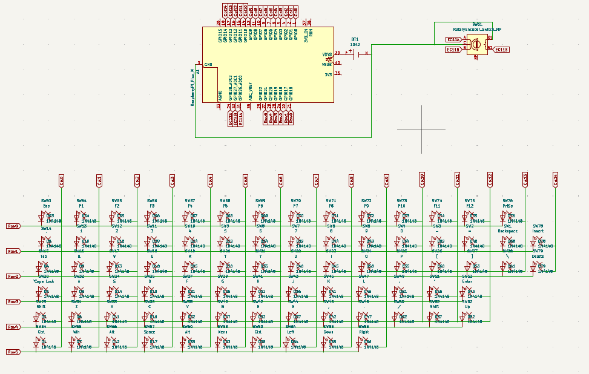

My initial impression was that ill have to program pico via arduino ide for ble, but it turns out that kmk has support for ble.
Will probably save me a lot of trouble later on when making the firmware.

Also man did it take time to get all the keys in the schematic.

I will pretty sure change the matrix a lot while ill do the wiring in the pcb editor so i didnt think much about them right now.

**Time Spent: 5h**

# June 29th:

Today i started adding stuff on the pcb. I remembered that i can add the dxf of keyboard which helped a lot in placement of the keys, still it took a very long time (80 keys). Also i found an smd battery holder so im gonna be using that. Tomorrow ill probably work on the connections and if time remains, on the silkscreen art.

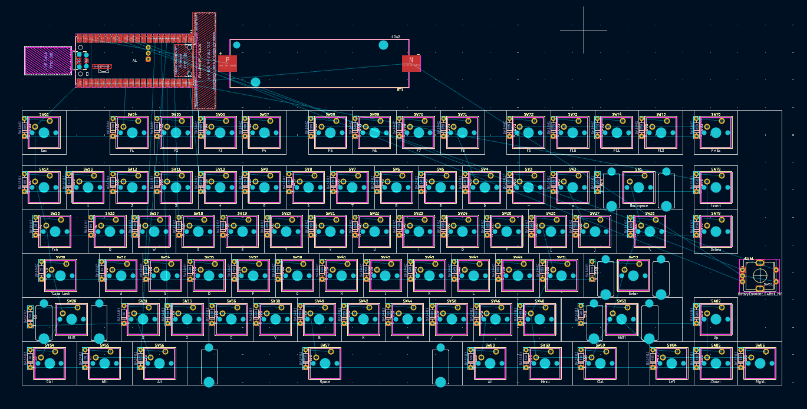

So many of the keys did not align with the dxf it was sooo painful having to fix most of the keys placement.

I also searched for some keycaps to use. Couldn't find anything cheap. Will either have them 3d printed or if i find some cheap enough keycaps ill use those.

**Time Spent: 4h**

# June 30th:

Today i wired all the diodes and switches. As i foreshadowed, i did change the schematic. But in the end i just gave up and created these long diagonal columns.

This time i actually used both the front and backside of the pcb, unlike in my macropad.

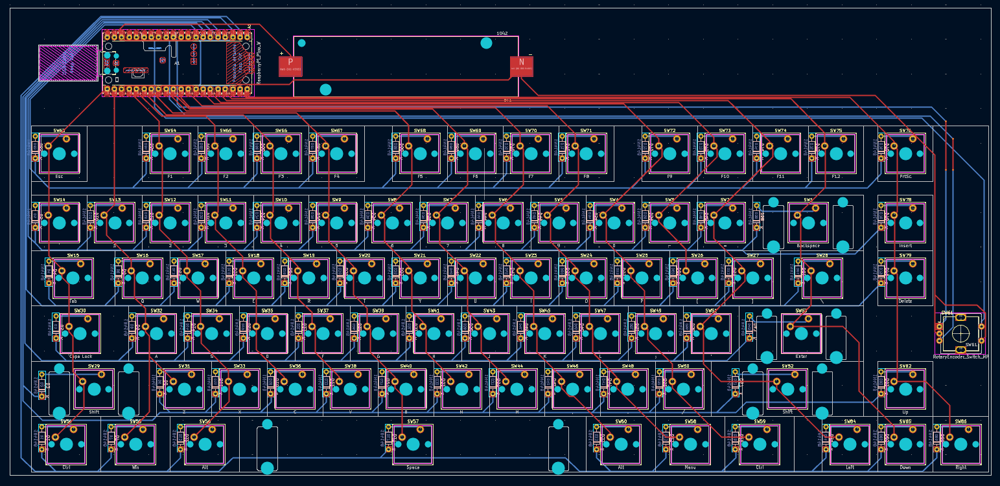

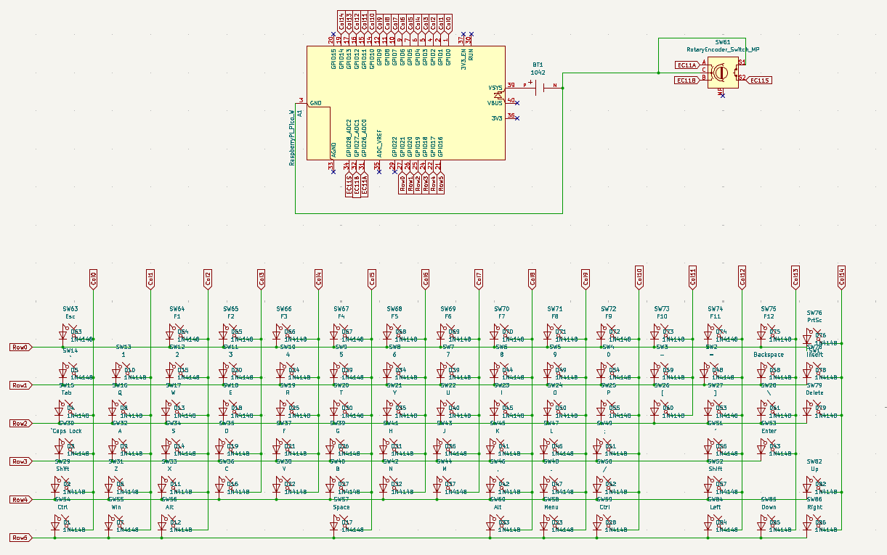

Now that i look at it, i think the pico and battery would have been better off beside the arrow keys.

**Time Spent: 4h**

# July 5th:

I was pretty overwhelmed with studies for the past few days so couldnt do anything.
I did check out some other people's journals and realized that i am writing too less stuff, so ill try to add more stuff.

Today i am adding the models to my pcb footprints for an easier cad later on.

Found some good models on gradcad

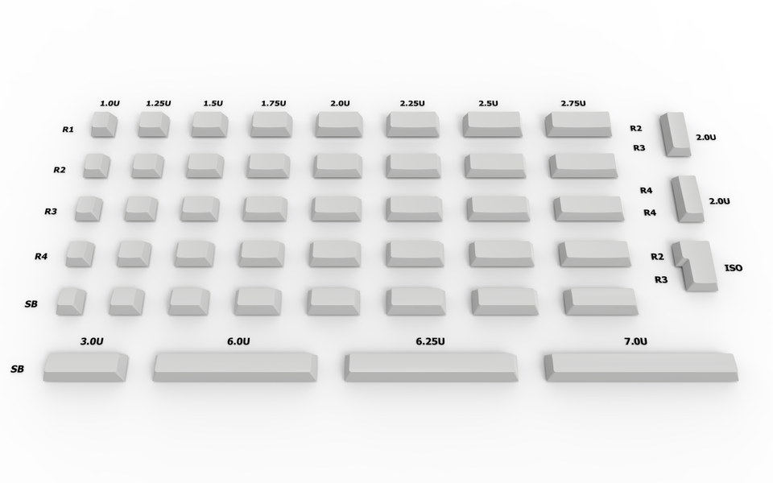 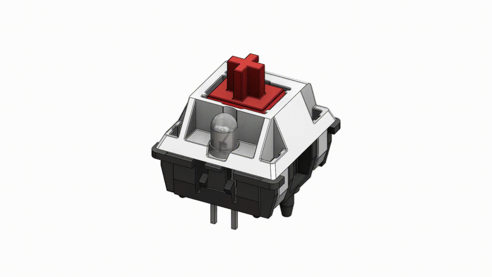

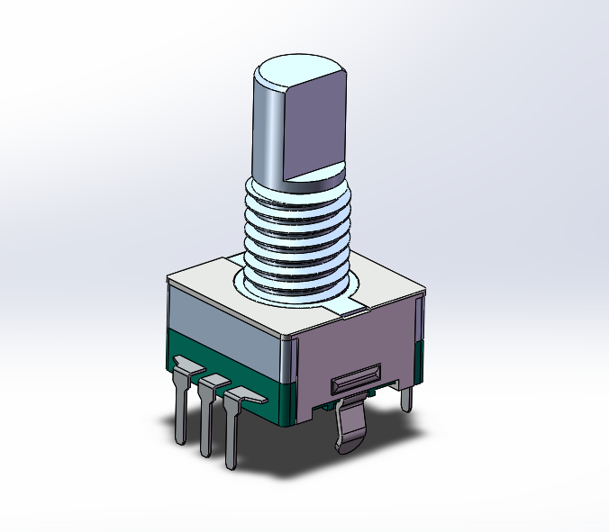 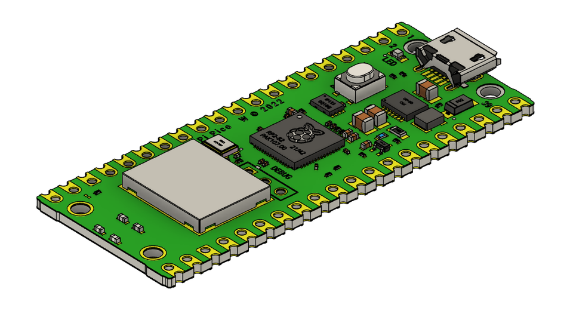

I started first with the 1x1 keys as they were the maximum in number. Upon trying to save, it repeatedly gave me permission error, which i bypassed by saving them as new footprints.

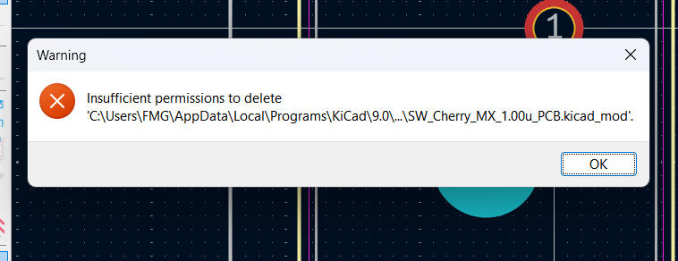 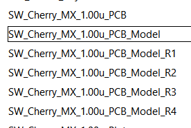

The _Model only have the switch whereas _Model_Rx has keycaps corresponding to their row.

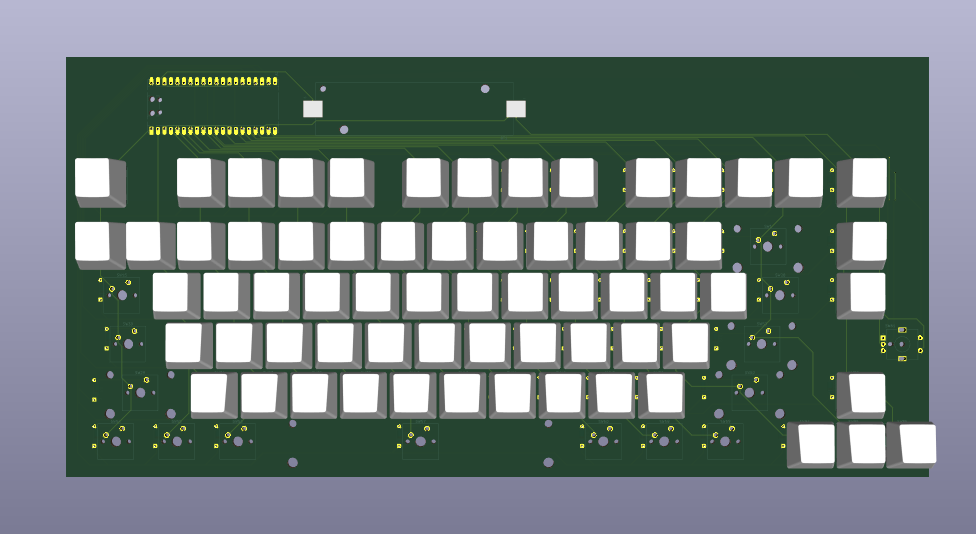

After this I took a short break, and then started with the rest of the keys

Since i cannot import stl, i first converted all the remaining keys to step, and then added them to their respective sizes and rows.

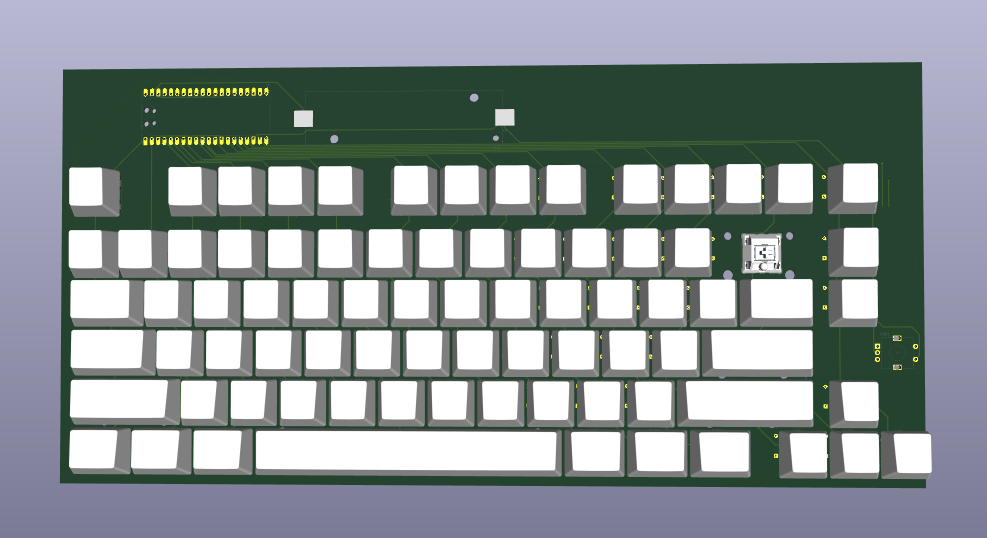

I was pretty happy with the result and thought to myself that maybe i forgot to add the keycap for backspace and didnt think much about it.
Next I started the pico, encoder and battery holder models.

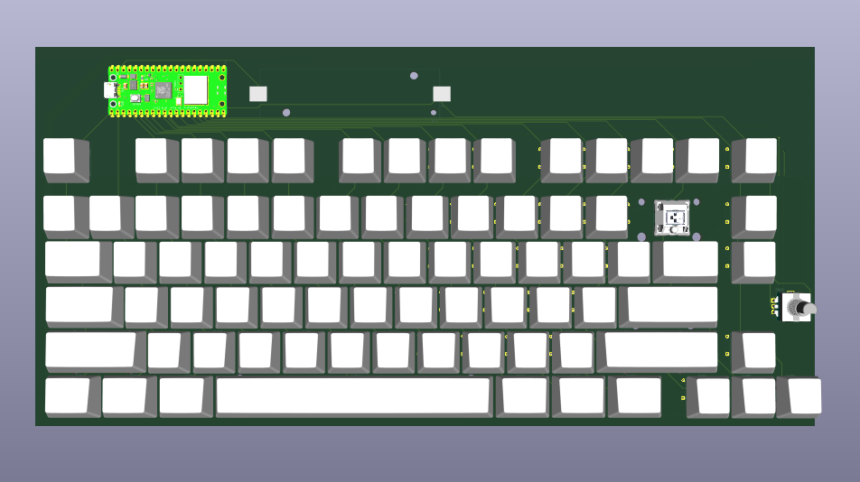

You might have noticed that the battery holder doesnt have its model and the backspace key its keycap.
I kept trying again and again trying to fix but they remained stubborn.

I then got frustrated and restarted KiCad, still the same.

Then i calmed myself down, switched to a different model for each of them. It updated. Then i switched back to their actual models AND IT FINALLY WORKED.

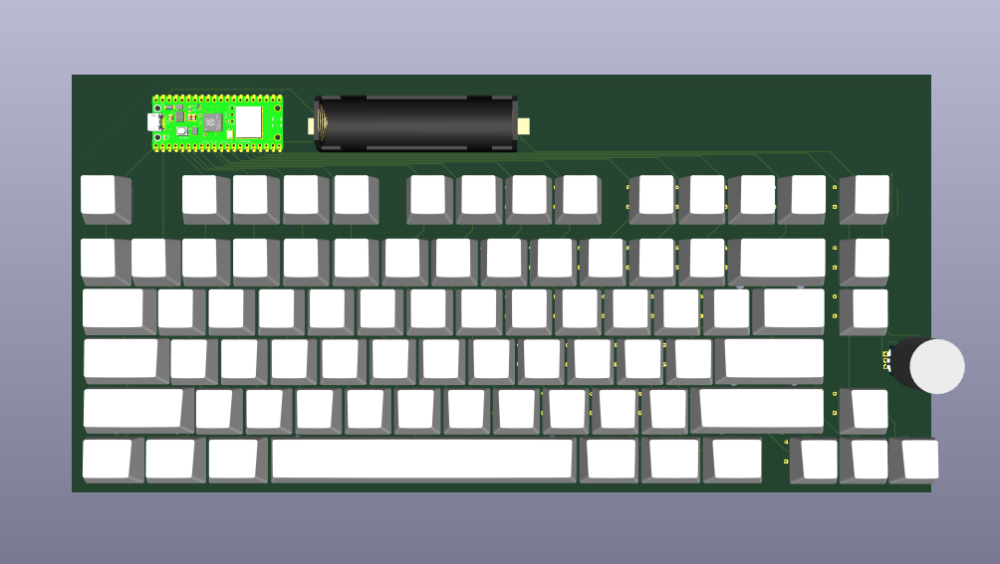

[Ignore the knob i didnt know how tall to make it T-T]

**Time Spent: 6h**