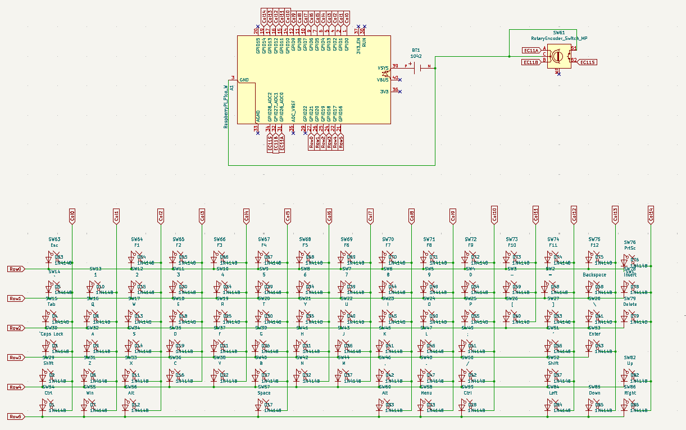

# June 28th: 

Today i started by making the basic schematic and researching on how the keyboard will actually work over bluetooth.

My initial impression was that ill have to program pico via arduino ide for ble, but it turns out that kmk has support for ble.
Will probably save me a lot of trouble later on when making the firmware.

Also man did it take time to get all the keys in the schematic.

I will pretty sure change the matrix a lot while ill do the wiring in the pcb editor so i didnt think much about them right now.

**Time spent: 5h**

# June 29th:

Today i started adding stuff on the pcb. I remembered that i can add the dxf of keyboard which helped a lot in placement of the keys, still it took a very long time (80 keys). Also i found an smd battery holder so im gonna be using that. Tomorrow ill probably work on the connections and if time remains, on the silkscreen art.

So many of the keys did not align with the dxf it was sooo painful having to fix most of the keys placement.

I also searched for some keycaps to use. Couldn't find anything cheap. Will either have them 3d printed or if i find some cheap enough keycaps ill use those.

**Time spent: 4h**

# June 30th:

Today i wired all the diodes and switches. As i foreshadowed, i did change the schematic. But in the end i just gave up and created these long diagonal columns.

This time i actually used both the front and backside of the pcb, unlike in my macropad.

Now that i look at it, i think the pico and battery would have been better off beside the arrow keys.

**Time spent: 4h**